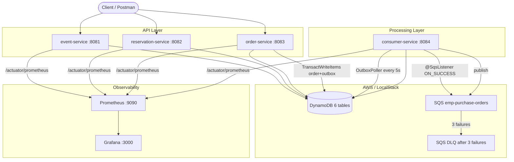
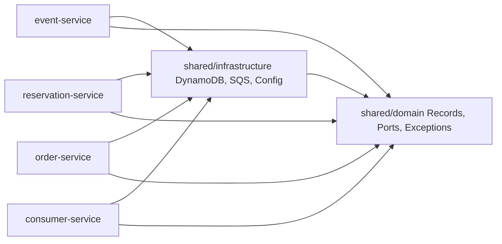

# Architecture — Event Management Platform v2 (Microservices)

## Overview

Microservices monorepo with **Clean Architecture** (Domain → Application → Infrastructure).
4 independent services communicating via **DynamoDB** (state) and **SQS** (async events).

## System Architecture



## Module Dependencies



## Data Model (DynamoDB)

| Table | PK | SK | GSI1 | TTL | Purpose |
|---|---|---|---|---|---|
| `emp-events` | `EVENT#id` | `METADATA` | `STATUS#<status>` | — | Event + atomic counter |
| `emp-reservations` | `RESERVATION#id` | `USER#userId` | `STATUS#ACTIVE / expiresAt` | 10 min | Auto-expiry |
| `emp-orders` | `ORDER#id` | `RESERVATION#id` | `USER#userId` | — | Order state |
| `emp-outbox` | `OUTBOX#id` | `CREATED_AT#ts` | `PUBLISHED#false` | 24h | Transactional outbox |
| `emp-idempotency-keys` | `KEY#uuid` | `IDEMPOTENCY` | — | 24h | Dedup cache |
| `emp-audit` | `AUDIT#entityId` | `TIMESTAMP#iso` | — | 90 days | Compliance trail |

## Concurrency Control — Conditional Writes

```
UpdateItem:
  Key: { PK: "EVENT#evt_123" }
  UpdateExpression: SET availableCount = availableCount - :n, version = version + 1
  ConditionExpression: availableCount >= :n AND version = :expectedVersion

  Success  → availableCount decremented atomically
  ConditionalCheckFailedException
    → retryWhen(Retry.backoff(3, 100ms))
    → After 3 retries: 409 Conflict to client
```

Why conditional writes over distributed locks?
- No external lock service (no Redis, no SPOF)
- DynamoDB handles atomicity natively at item level
- O(1) performance regardless of concurrent writers
- Self-healing: no lock release needed on failure

## Write Sharding for Popular Events

For events with >10,000 tickets, inventory is split across 8 shards to prevent DynamoDB hot partition:

```
EVENT#evt_123#SHARD_0  → availableCount: 1250
EVENT#evt_123#SHARD_1  → availableCount: 1250
...
EVENT#evt_123#SHARD_7  → availableCount: 1250
```

- Reservation: picks ThreadLocalRandom.current().nextInt(8) shard
- Availability query: aggregates all 8 shards (parallel Flux, then sum)
- Trade-off: slight read lag on availability (eventually consistent sum)
