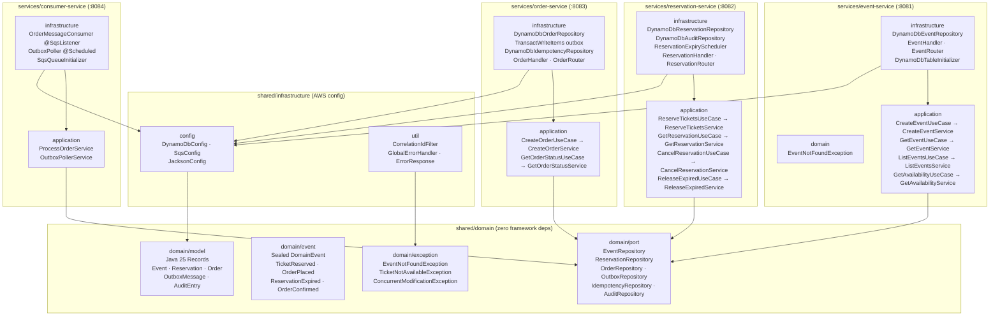

# Clean Architecture — Microservices Monorepo v2

## Dependency Rule

```
ALLOWED:    Infrastructure → Application → Domain
FORBIDDEN:  Domain → Application
FORBIDDEN:  Domain → Infrastructure
FORBIDDEN:  Application → Infrastructure
```

## Module Structure



## Package Structure per Service

```
{service}/src/main/java/com/nequi/{service}/
│
├── application/
│   ├── port/in/        UseCase interfaces (input ports)
│   ├── port/out/       Repository + publisher interfaces (output ports)
│   ├── usecase/        Use case implementations (orchestration only)
│   └── dto/            Request/Response Java 25 Records
│
├── domain/             (in shared/domain — consumed as dependency)
│   ├── model/          Aggregate roots and value objects (Records)
│   ├── event/          Domain events (sealed Records)
│   ├── exception/      Business exceptions
│   └── port/           Repository interfaces
│
└── infrastructure/
    ├── config/         DynamoDB table initializer, validation config
    ├── persistence/
    │   ├── dynamodb/
    │   │   ├── entity/     DynamoDB @DynamoDbBean entities
    │   │   └── repository/ Port implementations
    ├── web/
    │   ├── handler/    WebFlux functional handlers
    │   └── router/     RouterFunction beans
    ├── messaging/      SQS listener (consumer-service only)
    └── scheduler/      @Scheduled jobs (reconciliation, outbox poller)
```

## Java 25 Features by Layer

| Layer | Feature | Example |
|---|---|---|
| Domain | Records | `record Event(String id, int availableCount, long version, ...)` |
| Domain | Sealed interfaces | `sealed interface DomainEvent permits TicketReserved, OrderPlaced...` |
| Application | Pattern matching | `switch(ex) { case EventNotFoundException e -> 404; ... }` |
| Infrastructure | Virtual Threads | `spring.threads.virtual.enabled: true` |
| Infrastructure | Pattern matching | `GlobalErrorHandler` maps exceptions to HTTP status codes |
