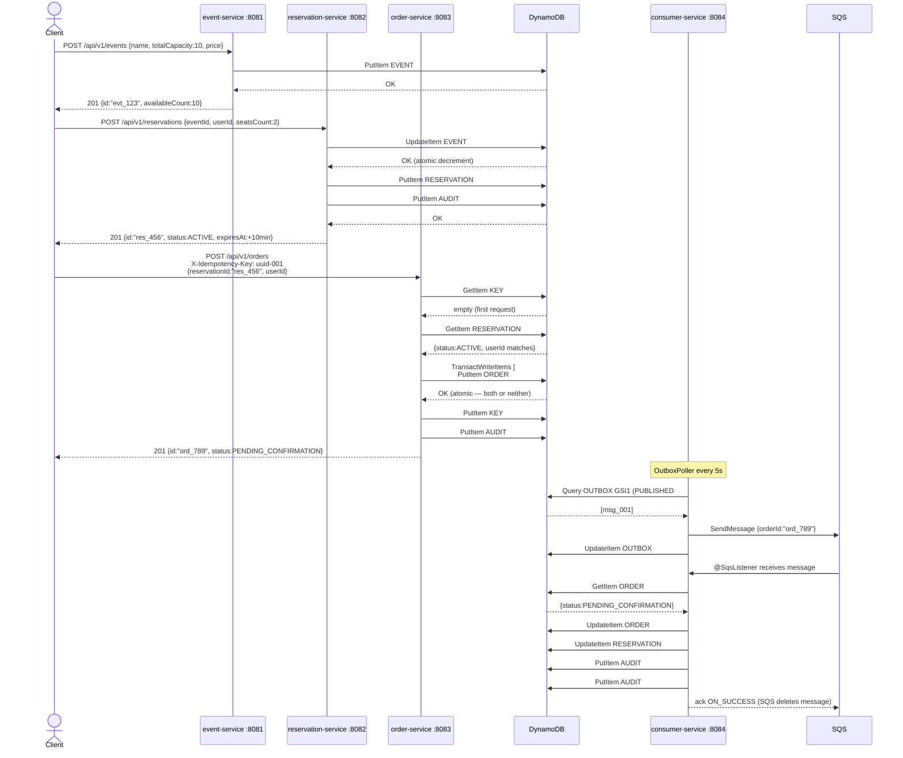
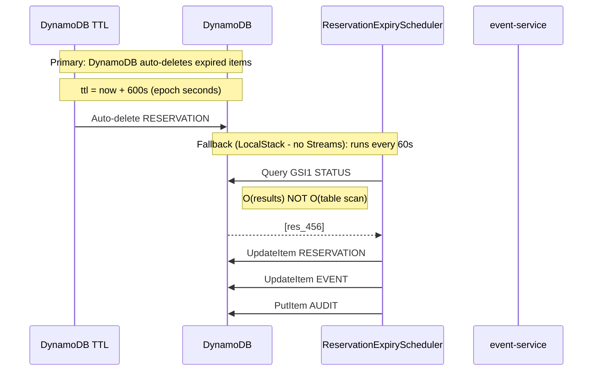
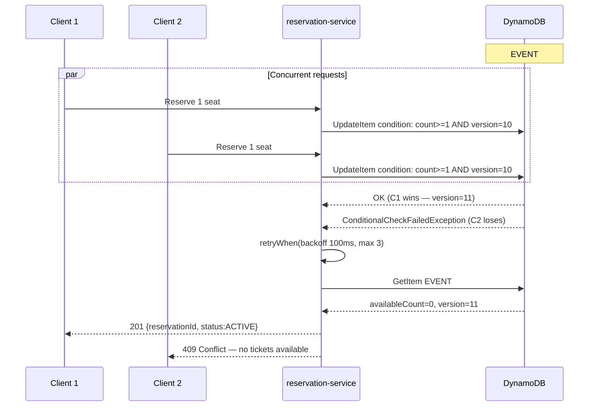

# Reservation & Order Flow — Microservices v2

## Complete Happy Path

```mermaid
sequenceDiagram
    actor Client
    participant ES as event-service :8081
    participant RS as reservation-service :8082
    participant OS as order-service :8083
    participant DDB as DynamoDB
    participant CS as consumer-service :8084
    participant SQS as SQS

    %% ── Step 1: Create Event ───────────────────────────────────
    Client->>ES: POST /api/v1/events {name, totalCapacity:10, price}
    ES->>DDB: PutItem EVENT#evt_123 METADATA<br/>availableCount=10, version=0, GSI1PK=STATUS#ACTIVE
    DDB-->>ES: OK
    ES-->>Client: 201 {id:"evt_123", availableCount:10}

    %% ── Step 2: Reserve Tickets (Conditional Write) ────────────
    Client->>RS: POST /api/v1/reservations {eventId, userId, seatsCount:2}
    RS->>DDB: UpdateItem EVENT#evt_123<br/>condition: availableCount>=2 AND version=0<br/>SET availableCount=8, version=1
    DDB-->>RS: OK (atomic decrement)
    RS->>DDB: PutItem RESERVATION#res_456<br/>USER#user_789 TTL=now+600s
    RS->>DDB: PutItem AUDIT#res_456 NONE→ACTIVE
    DDB-->>RS: OK
    RS-->>Client: 201 {id:"res_456", status:ACTIVE, expiresAt:+10min}

    %% ── Step 3: Create Order (Transactional Outbox) ────────────
    Client->>OS: POST /api/v1/orders<br/>X-Idempotency-Key: uuid-001<br/>{reservationId:"res_456", userId}
    OS->>DDB: GetItem KEY#uuid-001 (idempotency check)
    DDB-->>OS: empty (first request)
    OS->>DDB: GetItem RESERVATION#res_456
    DDB-->>OS: {status:ACTIVE, userId matches}
    OS->>DDB: TransactWriteItems [<br/>  PutItem ORDER#ord_789 PENDING_CONFIRMATION,<br/>  PutItem OUTBOX#msg_001 published=false<br/>]
    DDB-->>OS: OK (atomic — both or neither)
    OS->>DDB: PutItem KEY#uuid-001 (cache 24h)
    OS->>DDB: PutItem AUDIT#ord_789 NONE→PENDING_CONFIRMATION
    OS-->>Client: 201 {id:"ord_789", status:PENDING_CONFIRMATION}

    %% ── Step 4: OutboxPoller publishes to SQS ──────────────────
    Note over CS: OutboxPoller every 5s
    CS->>DDB: Query OUTBOX GSI1 (PUBLISHED#false)
    DDB-->>CS: [msg_001]
    CS->>SQS: SendMessage {orderId:"ord_789"}
    CS->>DDB: UpdateItem OUTBOX#msg_001 published=true

    %% ── Step 5: SQS Consumer processes order ───────────────────
    SQS->>CS: @SqsListener receives message
    CS->>DDB: GetItem ORDER#ord_789
    DDB-->>CS: {status:PENDING_CONFIRMATION}
    CS->>DDB: UpdateItem ORDER#ord_789 → CONFIRMED
    CS->>DDB: UpdateItem RESERVATION#res_456 → CONFIRMED
    CS->>DDB: PutItem AUDIT#ord_789 PENDING→CONFIRMED
    CS->>DDB: PutItem AUDIT#res_456 ACTIVE→CONFIRMED
    CS-->>SQS: ack ON_SUCCESS (SQS deletes message)
```

## Reservation Expiry Flow

```mermaid
sequenceDiagram
    participant TTL as DynamoDB TTL
    participant DDB as DynamoDB
    participant Sched as ReservationExpiryScheduler
    participant ES as event-service

    Note over TTL,DDB: Primary: DynamoDB auto-deletes expired items
    Note over TTL,DDB: ttl = now + 600s (epoch seconds)
    TTL->>DDB: Auto-delete RESERVATION#res_456 when ttl expires

    Note over Sched,DDB: Fallback (LocalStack - no Streams): runs every 60s
    Sched->>DDB: Query GSI1 STATUS#ACTIVE AND GSI1SK <= now
    Note right of DDB: O(results) NOT O(table scan)
    DDB-->>Sched: [res_456]
    Sched->>DDB: UpdateItem RESERVATION#res_456 ACTIVE→EXPIRED
    Sched->>DDB: UpdateItem EVENT#evt_123<br/>SET availableCount = availableCount + 2
    Sched->>DDB: PutItem AUDIT#res_456 ACTIVE→EXPIRED
```

## Oversell Prevention Under Concurrency

```mermaid
sequenceDiagram
    participant C1 as Client 1
    participant C2 as Client 2
    participant RS as reservation-service
    participant DDB as DynamoDB

    Note over DDB: EVENT#evt_123: availableCount=1, version=10

    par Concurrent requests
        C1->>RS: Reserve 1 seat
        RS->>DDB: UpdateItem condition: count>=1 AND version=10
        C2->>RS: Reserve 1 seat
        RS->>DDB: UpdateItem condition: count>=1 AND version=10
    end

    DDB-->>RS: OK (C1 wins — version=11)
    DDB-->>RS: ConditionalCheckFailedException (C2 loses)

    RS->>RS: retryWhen(backoff 100ms, max 3)
    RS->>DDB: GetItem EVENT#evt_123 (re-read)
    DDB-->>RS: availableCount=0, version=11
    RS-->>C1: 201 {reservationId, status:ACTIVE}
    RS-->>C2: 409 Conflict — no tickets available
```
