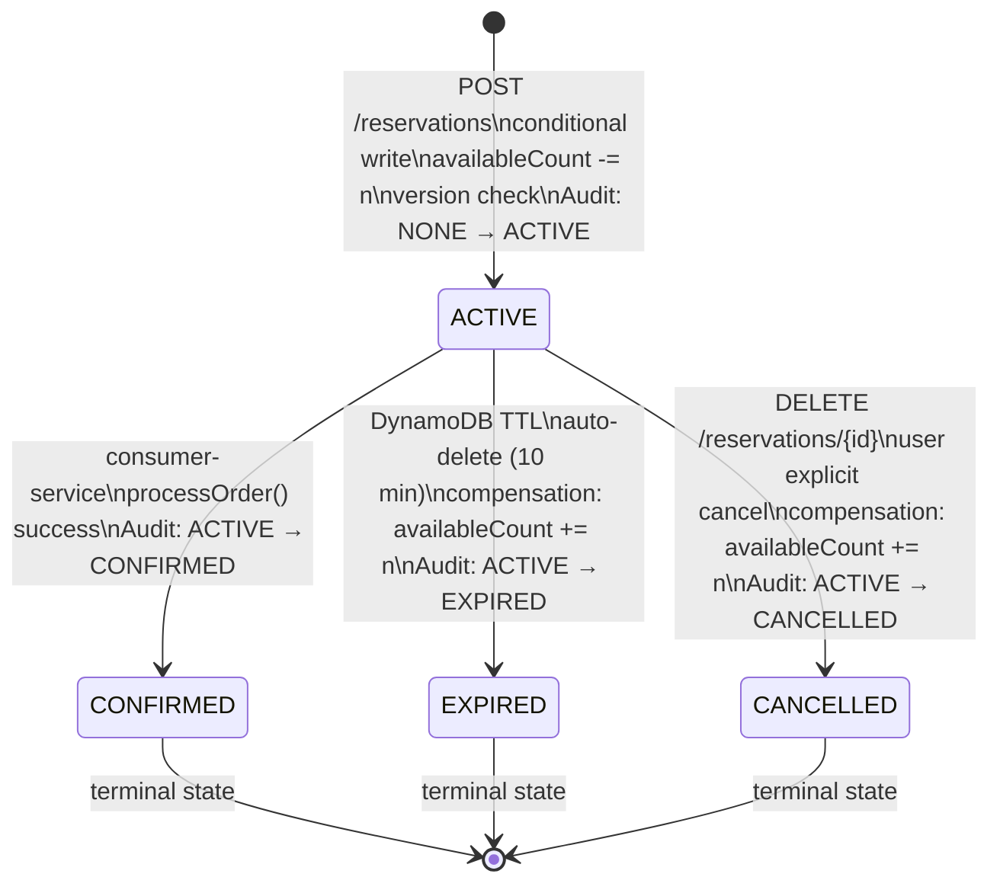
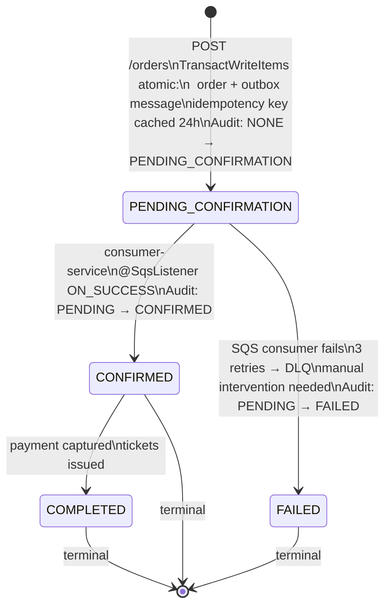
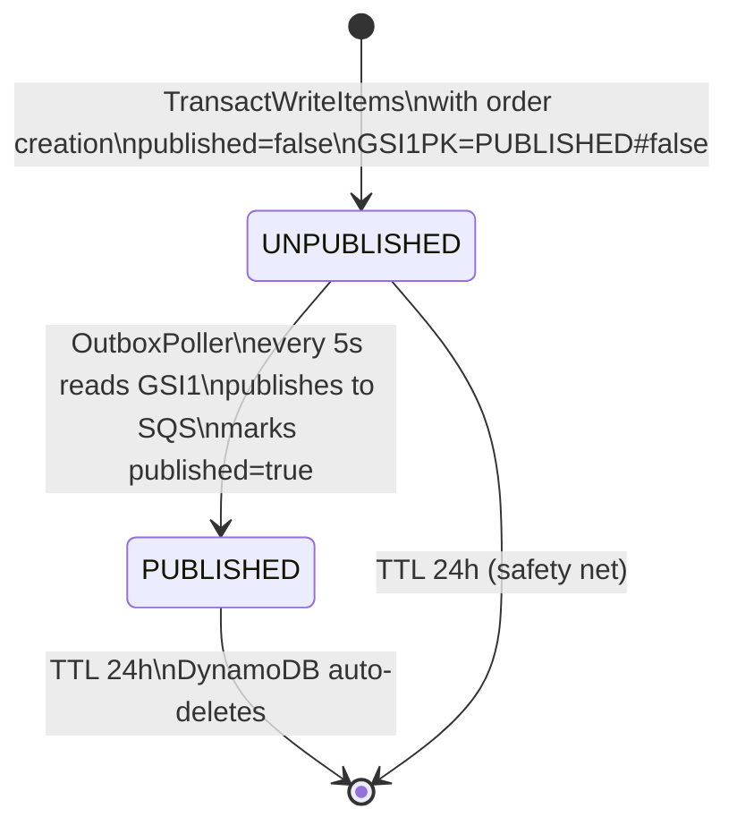

# State Machines — Microservices v2

## Reservation State Machine



**Key rule:** Every transition is atomic (TransactWriteItems or UpdateItem + conditional write) and recorded in emp-audit with 90-day TTL.

## Order State Machine



## Outbox Message State Machine



## Java 25 Pattern Matching — Exception → HTTP Status

```java
// GlobalErrorHandler.java — sealed switch, no default needed for known types
HttpStatus status = switch (ex) {
    case EventNotFoundException ignored          -> HttpStatus.NOT_FOUND;           // 404
    case ReservationNotFoundException ignored    -> HttpStatus.NOT_FOUND;           // 404
    case OrderNotFoundException ignored          -> HttpStatus.NOT_FOUND;           // 404
    case TicketNotAvailableException ignored     -> HttpStatus.CONFLICT;            // 409
    case ConcurrentModificationException ignored -> HttpStatus.CONFLICT;            // 409
    case IdempotencyConflictException ignored    -> HttpStatus.UNPROCESSABLE_ENTITY;// 422
    case IllegalArgumentException ignored        -> HttpStatus.BAD_REQUEST;         // 400
    default -> {
        log.error("Unhandled exception", ex);
        yield HttpStatus.INTERNAL_SERVER_ERROR;                                     // 500
    }
};
```

## AuditService Integration (v2 Fix)

In v1 the `AuditService` was implemented but **never called**. In v2 every state transition calls `auditRepository.save()`:

| Service | Transition | Trigger |
|---|---|---|
| reservation-service | NONE → ACTIVE | `ReserveTicketsService.execute()` |
| reservation-service | ACTIVE → CANCELLED | `CancelReservationService.execute()` |
| reservation-service | ACTIVE → EXPIRED | `ReleaseExpiredReservationsService.execute()` |
| consumer-service | NONE → PENDING_CONFIRMATION | order-service via `CreateOrderService` |
| consumer-service | PENDING → CONFIRMED | `ProcessOrderService.process()` |
| consumer-service | ACTIVE → CONFIRMED | `ProcessOrderService.process()` (reservation) |
