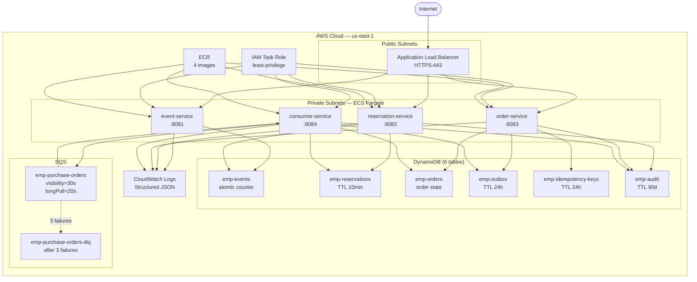

# AWS Production Architecture — Microservices v2

## Infrastructure Overview



## Why Each AWS Service

| Requirement | Solution | Rationale |
|---|---|---|
| No overselling | DynamoDB conditional writes | Atomic operation at DB level, no distributed lock needed |
| Zero zombie orders | DynamoDB TransactWriteItems | Outbox + order written atomically or not at all |
| Reservation expiry | DynamoDB TTL + Streams | O(1), zero compute, scales to millions free |
| At-least-once delivery | SQS Standard + DLQ | Consumer idempotent, 3 retries then DLQ for monitoring |
| High concurrency | ECS Fargate auto-scaling | Scale 2→20 tasks in 60s based on CPU/SQS depth |
| Zero-downtime deploy | ECS rolling update | 50% min healthy, 200% max during deploy |
| Financial data integrity | DynamoDB PITR | Point-in-time recovery for 35 days |
| No static credentials | ECS Task IAM Role | DefaultCredentialsProvider reads role automatically |
| Observability | CloudWatch + Prometheus | Structured JSON logs + Micrometer metrics |

## IAM Least Privilege (Terraform managed)

```
ECS Task Role → Policy:
  DynamoDB:
    GetItem, PutItem, UpdateItem, DeleteItem, Query
    on arn:aws:dynamodb:*:*:table/emp-*
    on arn:aws:dynamodb:*:*:table/emp-*/index/*

  SQS:
    SendMessage, ReceiveMessage, DeleteMessage, GetQueueAttributes
    on arn:aws:sqs:*:*:emp-purchase-orders*

  CloudWatch Logs:
    CreateLogGroup, CreateLogStream, PutLogEvents
    on arn:aws:logs:*:*:log-group:/ecs/emp-*
```

## Deployment Flow (CI/CD)

```
Push to main ──→ GitHub Actions ──→ Build + Test (./mvnw test)
                                  ──→ Docker build × 4 services
                                  ──→ Push to ECR
                                  ──→ Terraform plan
                                  ──→ [Manual approval]
                                  ──→ Terraform apply
                                  ──→ ECS rolling update
                                  ──→ Health check /actuator/health
```

## Cost Estimate (staging — 2 tasks per service)

| Resource | Config | Monthly |
|---|---|---|
| ECS Fargate (8 tasks × 0.5vCPU/1GB) | always-on | ~$65 |
| DynamoDB (6 tables, PAY_PER_REQUEST) | light load | ~$5 |
| SQS (2 queues) | light load | ~$1 |
| ALB | 1 instance | ~$20 |
| NAT Gateway | 1 AZ | ~$35 |
| ECR (4 repos) | storage | ~$2 |
| **Total** | | **~$128/month** |

Production: add auto-scaling, multi-AZ NAT, CloudFront → ~$200-400/month depending on traffic.
