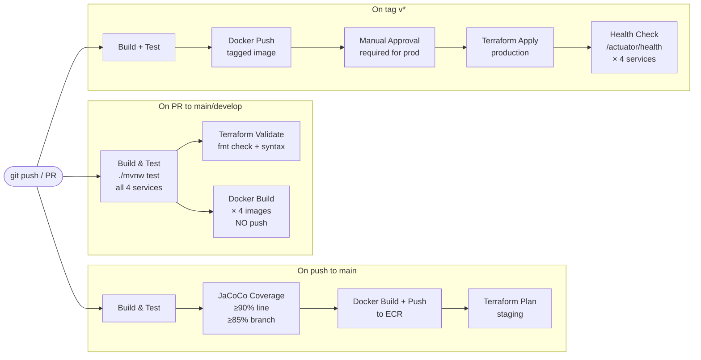

# CI/CD Pipeline — GitHub Actions (Microservices v2)

## Pipeline Overview



## Build Matrix — Multi-Module Maven

```yaml
# Each service built independently for parallel execution
strategy:
  matrix:
    service: [event-service, reservation-service, order-service, consumer-service]

steps:
  - name: Build shared modules first
    run: ./mvnw install -pl shared/domain,shared/infrastructure -DskipTests

  - name: Test ${{ matrix.service }}
    run: ./mvnw test -pl services/${{ matrix.service }}

  - name: JaCoCo coverage check
    run: ./mvnw verify -pl services/${{ matrix.service }} -DskipTests=false
```

## Docker Strategy — 4 Independent Images

```
ECR Repository per service:
  {account}.dkr.ecr.us-east-1.amazonaws.com/emp-event-service:{tag}
  {account}.dkr.ecr.us-east-1.amazonaws.com/emp-reservation-service:{tag}
  {account}.dkr.ecr.us-east-1.amazonaws.com/emp-order-service:{tag}
  {account}.dkr.ecr.us-east-1.amazonaws.com/emp-consumer-service:{tag}

Tag strategy:
  PR merge → :latest
  Release tag v1.2.3 → :1.2.3 + :stable
```

## Terraform State

```
Remote backend: S3 bucket (nequi-emp-terraform-state)
State locking:  DynamoDB table (emp-tf-lock)
Workspaces:     staging / production
```

## Secrets Management

```
GitHub Secrets:
  AWS_ACCESS_KEY_ID      → for CI/CD ECR push + Terraform
  AWS_SECRET_ACCESS_KEY  → (only in CI/CD, not in app)
  ECR_REGISTRY           → account ID

Application (ECS):
  No static credentials — uses ECS Task IAM Role
  DefaultCredentialsProvider reads role from IMDS automatically
```

## Gates — Build Fails If

- Any unit test fails
- JaCoCo line coverage < 90% on any service module
- JaCoCo branch coverage < 85% on any service module
- Docker build fails
- Terraform validate fails
- `terraform plan` shows destroy of production resources (manual review)
